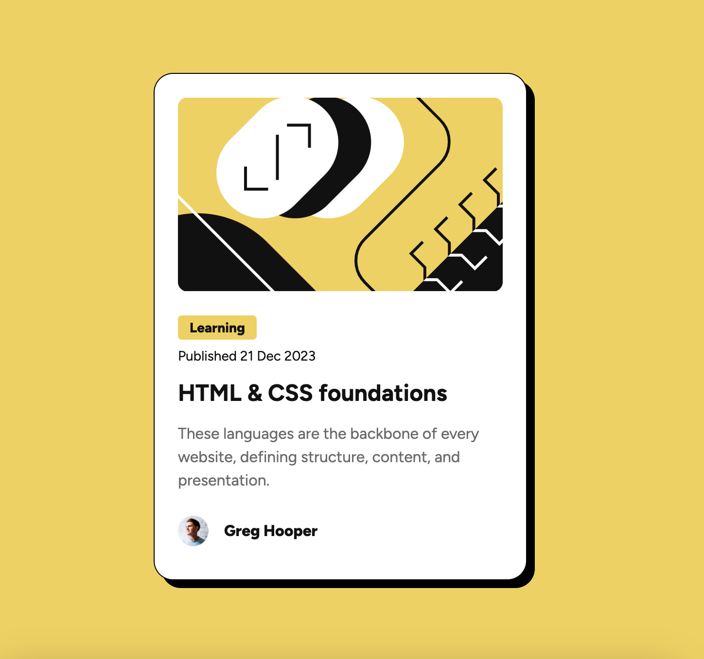

# Frontend Mentor - Blog preview card solution

This is a solution to the [Blog preview card challenge on Frontend Mentor](https://www.frontendmentor.io/challenges/blog-preview-card-ckPaj01IcS). Frontend Mentor challenges help you improve your coding skills by building realistic projects. 

## Table of contents

- [Overview](#overview)
  - [The challenge](#the-challenge)
  - [Screenshot](#screenshot)
  - [Links](#links)
- [My process](#my-process)
  - [Built with](#built-with)
  - [What I learned](#what-i-learned)
  - [Useful resources](#useful-resources)
- [Author](#author)

**Note: Delete this note and update the table of contents based on what sections you keep.**

## Overview

### The challenge

Users should be able to:

- See hover and focus states for all interactive elements on the page

### Screenshot

### Links

- Solution URL: [Add solution URL here](https://your-solution-url.com)
- Live Site URL: [Add live site URL here](https://your-live-site-url.com)

## My process

### Built with

- Semantic HTML5 markup
- CSS custom properties
- Flexbox
- BEM css principles

### What I learned
This challenge introduced me to a lot of new things!
Prior to this I had never used box-shadow. 

Also, in response to some helpful feedback by FEM user [MikDra1](https://www.frontendmentor.io/profile/MikDra1) I looked into the BEM naming conventions for css, which is what I used for this project. 

### Useful resources
Check out this inctroduction to BEM: https://getbem.com/introduction/

## Author
- Frontend Mentor - [JonDoesFrontEnd](https://www.frontendmentor.io/profile/JonDoesFrontEnd)

